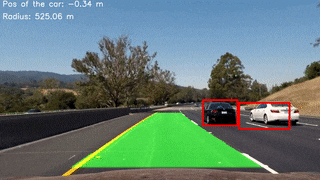

# Vehicle-Detection-and-Tracking
### Udacity Self-Driving Car Engineer Nanodegree. Project: Vehicle Detection and Tracking

This Project is the fifth task of the Udacity Self-Driving Car Nanodegree program. The main goal of the project is to  a software pipeline to identify vehicles in a video from a front-facing camera on a car. Additionally, an [Advanced Lane Line](https://github.com/NikolasEnt/Advanced-Lane-Lines) finding algorithm was added from the fourth task of the Nanodegree program.



## Content of this repo

- `VehicheDetect.ipynb` Jupyter notebook with code for the project
- `laneline.py` python program for lane line detection from the project 4.
- `test_images` a directory with test images
- `camera_cal` a directory with camera calibration images from the project 4.
- `project_video_proc.mp4` - the result video
- `project_video.mp4` - the original raw video from [Udacity](https://github.com/udacity/CarND-Vehicle-Detection)

## Classifier

Features are needed to train a classifier and make predictions on the test or real-world images.

The project required to build a classifier that is able to answer if there is a car in a given image (subset of the whole image). To address this task three types of features were used: HOG (Histogram of Oriented Gradients) (shape features), binned color (color and shape features) and color histogram features (color only features). THis combination of features can provide enough information for image classification.

Firstly, an automated approach was applied to tune the HOG parameters (`orientations, pixels_per_cell, cells_per_block`).

Something like:
```Python
from skopt import gp_minimize
space  = [(8, 64),                  # nbins
          (6, 12),                  # orient
          (4, 16),                   # pix_per_cell
          (1, 2)]                   # cell_per_block
i = 0
def obj(params):
    global i
    nbins, orient, pix_per_cell, cell_per_block = params
    car_features = extract_features(cars[0:len(cars):10], nbins, orient, pix_per_cell, cell_per_block)
    notcar_features = extract_features(notcars[0:len(notcars):10], nbins, orient, pix_per_cell, cell_per_block)
    y = np.hstack((np.ones(len(cars[0:len(cars):10])), np.zeros(len(notcars[0:len(notcars):10]))))
    X = np.vstack((car_features, notcar_features)).astype(np.float64)                        
    # Fit a per-column scaler
    X_scaler = StandardScaler().fit(X)
    # Apply the scaler to X
    scaled_X = X_scaler.transform(X)
    X_train, X_test, y_train, y_test = train_test_split(scaled_X, y, test_size=0.2, random_state=22)
    svc = LinearSVC()
    svc.fit(X_train, y_train)
    test_acc = svc.score(X_test, y_test)
    print i, params, test_acc
    i+=1
    return 1.0-test_acc
    
res = gp_minimize(obj, space, n_calls=20, random_state=22)
"Best score=%.4f" % res.fun
```

However, results were not very good because it ended with high numbers for HOG parameters which results in very slow feature extraction with comparable to less computational-expensive parameters set accuracy. That is why the parameters for HOG as well as parameters for othe features extractors were finetuned manually by try and error process so that it optimize accuracy and computation time.

Here is an example of a train image and its HOG:


Final parameter for feature extraction:

```Python
color_space = 'LUV' # Can be RGB, HSV, LUV, HLS, YUV, YCrCb
orient = 8  # HOG orientations
pix_per_cell = 8 # HOG pixels per cell
cell_per_block = 2 # HOG cells per block
hog_channel = 0 # Can be 0, 1, 2, or "ALL"
spatial_size = (16, 16) # Spatial binning dimensions
hist_bins = 32    # Number of histogram bins
```

Normalizing ensures that your classifier's behavior isn't dominated by just a subset of the features, and that the training process is as efficient as possible. That is why, feature list was normolized by the `StandardScaler()` method from `sklearn`. The data is splitted into thaining and testing subsets (80% and 20%). The classifier is a linear SVM. It was found that it performs well enough and quite fast for the task. The code chunk under *Classifier* represents these operations.
